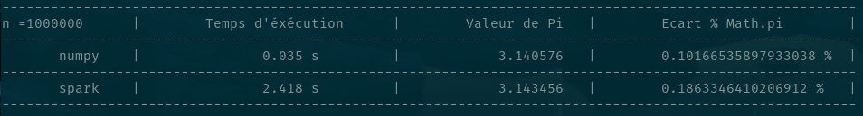

# piEstimator
Estimating Pi using two methods "numpy" and "spark" after simulating n random points inside a square that contains the unit circle.

To test this method, simply type on command line:
* First lets install pyspark and clone the repo
```
pip install pyspark ; git clone https://github.com/sayfchagtmi/piEstimator.git
```
* Change to project directory
```
cd piEstimator
```
* run the mothod using 
```
sh main.sh
```
* The command above will simulate 10 times 7 points by default in order to estimate pi. If you want to specify n (for example n=10⁵) simply type:
```
sh main.sh $[10**5]
```
* This is an outpout example from the console


* The result for n = 10⁶ is:

